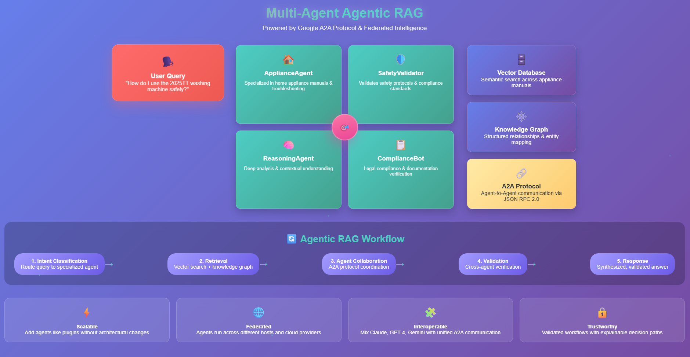

# Agentic RAG Patterns Implementation

## Overview

Reference implementation of Agentic Retrieval-Augmented Generation (Agentic RAG) using A2AJava, a structured Java agent framework. The implementation follows the design patterns introduced in the paper ["Agentic Retrieval-Augmented Generation: A Survey on Agentic RAG"](https://arxiv.org/abs/2501.09136), which explores how agent-based systems can improve the reliability, performance, and structure of retrieval workflows.

## What the Paper Proposes

The Agentic RAG paper introduces a more structured and selective approach to information retrieval and reasoning. While traditional RAG systems retrieve context from a vector database for every query and pass it to an LLM for response generation, Agentic RAG systems use intelligent agents to:

- Decide whether a query needs retrieval at all
- Choose which tools or actions to invoke
- Execute deterministic steps when possible
- Use LLMs or retrieval fallback only when necessary

The paper outlines several agentic control patterns including:
- Agentic Routing
- Tool Use
- Reflection
- Planning
- Multi-Agent Workflows

These patterns emphasize reducing hallucinations, lowering compute costs, and improving response speed by making agents responsible for selective control and execution.

 

## What is A2AJava?

[A2AJava](https://github.com/vishalmysore/a2ajava) is a Java framework for defining and invoking structured, deterministic agents. It is built on the Action-to-Action (A2A) protocol, which enables agents to declare actions, exchange JSON-compatible inputs and outputs, and collaborate using semantic memory and retrieval.

### Key Features

- Build both A2A and MCP compatible agents in Java, Kotlin, Groovy, and Scala
- Annotated Java methods as agent tools (`@Action`)
- Grouped agents via `@Agent`
- Prompt control using `@Prompt`
- Integration with vector databases for storing and retrieving semantically embedded content
- Optional fallback to LLM/RAG for open-ended inputs

A2AJava is well-suited to implement the Agentic RAG model because it focuses on structured action-based execution, not black-box generation.

## Agent Examples in the Reference Implementation

### 1. 🧺 WashingMachineManual Agent

This agent is responsible for storing and retrieving concise product usage instructions.

```java
@Agent(groupName = "washing machine", groupDescription = "documents related to washing machine operations")
public class WashingMachineManual {
    @Autowired
    private A2ARagService vectorService;

    @Action(description = "Store instructions for washing machine with model number")
    public String storeInstructionsForWashingMachine(
            @Prompt(describe = "not more than 10 lines of instructions") String instructions, 
            String modelNumber) {
        vectorService.storeData(instructions + "\n model number is " + modelNumber);
        return "Instructions stored for model: " + modelNumber;
    }

    @Action(description = "Retrieve instructions for washing machine with model number")
    public String retrieveInstructionsForWashingMachine(String modelNumber) {
        String instructions = vectorService.getSimilarDocuments(modelNumber)
                                        .get(0)
                                        .getFormattedContent();
        return (instructions == null || instructions.isEmpty())
            ? "No instructions found for model " + modelNumber
            : "Instructions: " + instructions;
    }
}
```

### 2. 🧹 VacuumCleanerManual Agent

This agent functions similarly to the washing machine agent, but focuses on vacuum cleaner models.

```java
@Agent(groupName = "vacuum cleaner", groupDescription = "documents related to vacuum cleaner operations")
public class VacuumCleanerManual {
    @Autowired
    private A2ARagService vectorService;

    @Action(description = "Store instructions for vacuum cleaner with model number")
    public String storeInstructionsForVacuumCleaner(
            @Prompt(describe = "not more than 10 lines") String instructions, 
            String modelNumber) {
        vectorService.storeData(instructions + "\n model number is " + modelNumber);
        return "Stored successfully.";
    }

    @Action(description = "Retrieve instructions for vacuum cleaner with model number")
    public String retrieveInstructionsForVacuumCleaner(String modelNumber) {
        String instructions = vectorService.getSimilarDocuments(modelNumber)
                                        .get(0)
                                        .getFormattedContent();
        return (instructions == null || instructions.isEmpty())
            ? "No instructions found"
            : "Instructions: " + instructions;
    }
}
```

### 3. ⚖️ LegalAgent

This agent exposes structured legal analysis tools such as compliance checking, clause summarization, and risk term detection.

```java
@Agent(groupName = "legal agent", groupDescription = "analyze and reason over legal clauses")
public class LegalAgent {
    @Action(description = "Summarize a legal clause")
    public String summarizeClause(@Prompt(describe = "clause to summarize") String clause) {
        // Call internal summarizer or vector DB summarizer
        return "Summary: ..." + clause;
    }

    @Action(description = "Check clause compliance")
    public String checkCompliance(String clause, String standard) {
        // Perform rule-based comparison
        return "Clause is compliant with: " + standard;
    }

    @Action(description = "Detect missing risk terms")
    public String detectMissingRiskTerms(String clause) {
        // Use local pattern matcher or embedding comparison
        return "Missing risk terms: liability, arbitration.";
    }
}
```

### 4. 🍳 RecipeAgent (Cooking Assistant)

An agent that stores cooking instructions and retrieves them by dish name, ingredient, or cooking method.

```java
@Agent(groupName = "recipes", groupDescription = "assist with storing and retrieving cooking recipes")
public class RecipeAgent {
    @Autowired
    private A2ARagService vectorService;

    @Action(description = "Store a recipe by name")
    public String storeRecipe(
            @Prompt(describe = "recipe steps") String steps, 
            String dishName) {
        vectorService.storeData(steps + "\n dish name: " + dishName);
        return "Recipe stored for: " + dishName;
    }

    @Action(description = "Retrieve recipe by name")
    public String retrieveRecipe(String dishName) {
        String steps = vectorService.getSimilarDocuments(dishName)
                                  .get(0)
                                  .getFormattedContent();
        return (steps == null || steps.isEmpty())
            ? "No recipe found for: " + dishName
            : "Recipe: " + steps;
    }
}
```

## Comand Line Interface (CLI)

```json


curl  \
  -H "Content-Type: application/json" \
  -d '{
    "jsonrpc": "2.0",
    "method": "tools/call",
    "params": {
      "name": "retrieveInstructionsForRefrigerator",
      "arguments": {
        "provideAllValuesInPlainEnglish": {
          "value": "Please provide the operating instructions for the refrigerator model number XYZ123."
        }
      }
    },
    "id": 25
  }' http://localhost:7860
Jun 14, 2025 4:19:02 P.M. io.github.vishalmysore.debug.DebugCurlCommands getCurlCommands
INFO: A2A Curl Command for retrieveInstructionsForRefrigerator:
curl -v \
  -H "Content-Type: application/json" \
  -d '{
    "jsonrpc": "2.0",
    "method": "tasks/send",
    "params": {
      "id": "999789",
      "sessionId": "sdf44555",
      "message": {
        "role": "user",
        "parts": [
          {
            "type": "text",
            "text": "Please provide the operating instructions for the refrigerator model number XYZ123.",
            "metadata": null
          }
        ]
      }
    }
  }' http://localhost:7860
Jun 14, 2025 4:19:04 P.M. io.github.vishalmysore.debug.DebugCurlCommands getCurlCommands
INFO: MCP Curl Command for storeInstructionsForRefrigerator:
curl  \
  -H "Content-Type: application/json" \
  -d '{
    "jsonrpc": "2.0",
    "method": "tools/call",
    "params": {
      "name": "storeInstructionsForRefrigerator",
      "arguments": {
        "provideAllValuesInPlainEnglish": {
          "value": "Please provide the instructions for storing items in the refrigerator (not exceeding 10 lines) and the model number of the refrigerator. For example: Store perishable items on the top shelf, keep dairy products in their designated compartment, and ensure the door is closed tightly. Model Number: RF1234XYZ."
        }
      }
    },
    "id": 25
  }' http://localhost:7860
Jun 14, 2025 4:19:04 P.M. io.github.vishalmysore.debug.DebugCurlCommands getCurlCommands
INFO: A2A Curl Command for storeInstructionsForRefrigerator:
curl -v \
  -H "Content-Type: application/json" \
  -d '{
    "jsonrpc": "2.0",
    "method": "tasks/send",
    "params": {
      "id": "999789",
      "sessionId": "sdf44555",
      "message": {
        "role": "user",
        "parts": [
          {
            "type": "text",
            "text": "Please provide the instructions for storing items in the refrigerator (not exceeding 10 lines) and the model number of the refrigerator. For example: Store perishable items on the top shelf, keep dairy products in their designated compartment, and ensure the door is closed tightly. Model Number: RF1234XYZ.",
            "metadata": null
          }
        ]
      }
    }
  }' http://localhost:7860
Jun 14, 2025 4:19:05 P.M. io.github.vishalmysore.debug.DebugCurlCommands getCurlCommands
INFO: MCP Curl Command for retrieveInstructionsForWashingMachine:
curl  \
  -H "Content-Type: application/json" \
  -d '{
    "jsonrpc": "2.0",
    "method": "tools/call",
    "params": {
      "name": "retrieveInstructionsForWashingMachine",
      "arguments": {
        "provideAllValuesInPlainEnglish": {
          "value": "Please provide the washing machine instructions for model number WM1234."
        }
      }
    },
    "id": 25
  }' http://localhost:7860
Jun 14, 2025 4:19:05 P.M. io.github.vishalmysore.debug.DebugCurlCommands getCurlCommands
INFO: A2A Curl Command for retrieveInstructionsForWashingMachine:
curl -v \
  -H "Content-Type: application/json" \
  -d '{
    "jsonrpc": "2.0",
    "method": "tasks/send",
    "params": {
      "id": "999789",
      "sessionId": "sdf44555",
      "message": {
        "role": "user",
        "parts": [
          {
            "type": "text",
            "text": "Please provide the washing machine instructions for model number WM1234.",
            "metadata": null
          }
        ]
      }
    }
  }' http://localhost:7860
Jun 14, 2025 4:19:09 P.M. io.github.vishalmysore.debug.DebugCurlCommands getCurlCommands
INFO: MCP Curl Command for storeInstructionsForWashingMachine:
curl  \
  -H "Content-Type: application/json" \
  -d '{
    "jsonrpc": "2.0",
    "method": "tools/call",
    "params": {
      "name": "storeInstructionsForWashingMachine",
      "arguments": {
        "provideAllValuesInPlainEnglish": {
          "value": "Please store the following instructions for washing machine model WM1234: 1. Sort laundry by color. 2. Check pockets for items. 3. Use the appropriate cycle for fabric type. 4. Add detergent as per the instructions. 5. Close the door securely. 6. Select the desired temperature. 7. Start the machine. 8. Wait for the cycle to complete. 9. Remove laundry promptly. 10. Clean the lint filter after each use."
        }
      }
    },
    "id": 25
  }' http://localhost:7860
Jun 14, 2025 4:19:09 P.M. io.github.vishalmysore.debug.DebugCurlCommands getCurlCommands
INFO: A2A Curl Command for storeInstructionsForWashingMachine:
curl -v \
  -H "Content-Type: application/json" \
  -d '{
    "jsonrpc": "2.0",
    "method": "tasks/send",
    "params": {
      "id": "999789",
      "sessionId": "sdf44555",
      "message": {
        "role": "user",
        "parts": [
          {
            "type": "text",
            "text": "Please store the following instructions for washing machine model WM1234: 1. Sort laundry by color. 2. Check pockets for items. 3. Use the appropriate cycle for fabric type. 4. Add detergent as per the instructions. 5. Close the door securely. 6. Select the desired temperature. 7. Start the machine. 8. Wait for the cycle to complete. 9. Remove laundry promptly. 10. Clean the lint filter after each use.",
            "metadata": null
          }
        ]
      }
    }
  }' http://localhost:7860
Jun 14, 2025 4:19:11 P.M. io.github.vishalmysore.debug.DebugCurlCommands getCurlCommands
INFO: MCP Curl Command for retrieveInstructionsForVacuumCleaner:
curl  \
  -H "Content-Type: application/json" \
  -d '{
    "jsonrpc": "2.0",
    "method": "tools/call",
    "params": {
      "name": "retrieveInstructionsForVacuumCleaner",
      "arguments": {
        "provideAllValuesInPlainEnglish": {
          "value": "Please provide the instructions for the vacuum cleaner model number XYZ123."
        }
      }
    },
    "id": 25
  }' http://localhost:7860
Jun 14, 2025 4:19:11 P.M. io.github.vishalmysore.debug.DebugCurlCommands getCurlCommands
INFO: A2A Curl Command for retrieveInstructionsForVacuumCleaner:
curl -v \
  -H "Content-Type: application/json" \
  -d '{
    "jsonrpc": "2.0",
    "method": "tasks/send",
    "params": {
      "id": "999789",
      "sessionId": "sdf44555",
      "message": {
        "role": "user",
        "parts": [
          {
            "type": "text",
            "text": "Please provide the instructions for the vacuum cleaner model number XYZ123.",
            "metadata": null
          }
        ]
      }
    }
  }' http://localhost:7860
Jun 14, 2025 4:19:15 P.M. io.github.vishalmysore.debug.DebugCurlCommands getCurlCommands
INFO: MCP Curl Command for storeInstructionsForVacuumCleaner:
curl  \
  -H "Content-Type: application/json" \
  -d '{
    "jsonrpc": "2.0",
    "method": "tools/call",
    "params": {
      "name": "storeInstructionsForVacuumCleaner",
      "arguments": {
        "provideAllValuesInPlainEnglish": {
          "value": "Please store the following instructions for the vacuum cleaner model number VC123: 1. Plug in the vacuum cleaner. 2. Turn on the power switch. 3. Adjust the height setting according to the floor type. 4. Move the vacuum cleaner slowly across the floor. 5. Empty the dustbin when full. 6. Clean the filter regularly. 7. Store the vacuum cleaner in a dry place. 8. Do not vacuum wet surfaces. 9. For best results, vacuum once a week. 10. Refer to the manual for troubleshooting."
        }
      }
    },
    "id": 25
  }' http://localhost:7860
Jun 14, 2025 4:19:15 P.M. io.github.vishalmysore.debug.DebugCurlCommands getCurlCommands
INFO: A2A Curl Command for storeInstructionsForVacuumCleaner:
curl -v \
  -H "Content-Type: application/json" \
  -d '{
    "jsonrpc": "2.0",
    "method": "tasks/send",
    "params": {
      "id": "999789",
      "sessionId": "sdf44555",
      "message": {
        "role": "user",
        "parts": [
          {
            "type": "text",
            "text": "Please store the following instructions for the vacuum cleaner model number VC123: 1. Plug in the vacuum cleaner. 2. Turn on the power switch. 3. Adjust the height setting according to the floor type. 4. Move the vacuum cleaner slowly across the floor. 5. Empty the dustbin when full. 6. Clean the filter regularly. 7. Store the vacuum cleaner in a dry place. 8. Do not vacuum wet surfaces. 9. For best results, vacuum once a week. 10. Refer to the manual for troubleshooting.",
            "metadata": null
          }
        ]
      }
    }
  }' http://localhost:7860
Jun 14, 2025 4:19:17 P.M. io.github.vishalmysore.debug.DebugCurlCommands getCurlCommands
INFO: MCP Curl Command for retrieveInstructionsForAirConditioner:
curl  \
  -H "Content-Type: application/json" \
  -d '{
    "jsonrpc": "2.0",
    "method": "tools/call",
    "params": {
      "name": "retrieveInstructionsForAirConditioner",
      "arguments": {
        "provideAllValuesInPlainEnglish": {
          "value": "Please provide the instructions for the air conditioner model number ABC123."
        }
      }
    },
    "id": 25
  }' http://localhost:7860
Jun 14, 2025 4:19:17 P.M. io.github.vishalmysore.debug.DebugCurlCommands getCurlCommands
INFO: A2A Curl Command for retrieveInstructionsForAirConditioner:
curl -v \
  -H "Content-Type: application/json" \
  -d '{
    "jsonrpc": "2.0",
    "method": "tasks/send",
    "params": {
      "id": "999789",
      "sessionId": "sdf44555",
      "message": {
        "role": "user",
        "parts": [
          {
            "type": "text",
            "text": "Please provide the instructions for the air conditioner model number ABC123.",
            "metadata": null
          }
        ]
      }
    }
  }' http://localhost:7860
Jun 14, 2025 4:19:21 P.M. io.github.vishalmysore.debug.DebugCurlCommands getCurlCommands
INFO: MCP Curl Command for storeInstructionsForAirConditioner:
curl  \
  -H "Content-Type: application/json" \
  -d '{
    "jsonrpc": "2.0",
    "method": "tools/call",
    "params": {
      "name": "storeInstructionsForAirConditioner",
      "arguments": {
        "provideAllValuesInPlainEnglish": {
          "value": "Please store the following instructions for the air conditioner model AC1234:
1. Plug in the unit to a power source.
2. Use the remote control to power on the air conditioner.
3. Set the desired temperature using the + and – buttons.
4. Select the mode (Cool, Fan, or Heat) using the mode button.
5. Adjust the fan speed as needed.
6. Clean the air filter every month for optimal performance.
7. Ensure windows and doors are closed while in use.
8. Turn off the unit when not in use to save energy.
9. If the unit does not cool, check for obstructions.
10. For maintenance, contact a professional service provider.
"
        }
      }
    },
    "id": 25
  }' http://localhost:7860
Jun 14, 2025 4:19:21 P.M. io.github.vishalmysore.debug.DebugCurlCommands getCurlCommands
INFO: A2A Curl Command for storeInstructionsForAirConditioner:
curl -v \
  -H "Content-Type: application/json" \
  -d '{
    "jsonrpc": "2.0",
    "method": "tasks/send",
    "params": {
      "id": "999789",
      "sessionId": "sdf44555",
      "message": {
        "role": "user",
        "parts": [
          {
            "type": "text",
            "text": "Please store the following instructions for the air conditioner model AC1234:
1. Plug in the unit to a power source.
2. Use the remote control to power on the air conditioner.
3. Set the desired temperature using the + and – buttons.
4. Select the mode (Cool, Fan, or Heat) using the mode button.
5. Adjust the fan speed as needed.
6. Clean the air filter every month for optimal performance.
7. Ensure windows and doors are closed while in use.
8. Turn off the unit when not in use to save energy.
9. If the unit does not cool, check for obstructions.
10. For maintenance, contact a professional service provider.
",
            "metadata": null
          }
        ]
      }
    }
  }' http://localhost:7860
Jun 14, 2025 4:19:25 P.M. io.github.vishalmysore.debug.DebugCurlCommands getCurlCommands
INFO: MCP Curl Command for storeInstructionsForDishwasher:
curl  \
  -H "Content-Type: application/json" \
  -d '{
    "jsonrpc": "2.0",
    "method": "tools/call",
    "params": {
      "name": "storeInstructionsForDishwasher",
      "arguments": {
        "provideAllValuesInPlainEnglish": {
          "value": "Please store the following instructions for the dishwasher model DW1234:
1. Ensure all items are dishwasher safe.
2. Load the bottom rack with larger items and the top rack with smaller ones.
3. Avoid overcrowding the dishwasher to ensure proper cleaning.
4. Use the appropriate amount of detergent as per the manufacturers instructions.
5. Select the desired wash cycle based on the load type.
6. Check for any blockages in the spray arms before starting.
7. Close the door securely before starting the machine.
8. Wait for the cycle to complete before unloading.
9. Clean the filter regularly for optimal performance.
10. Refer to the user manual for any troubleshooting tips."
        }
      }
    },
    "id": 25
  }' http://localhost:7860
Jun 14, 2025 4:19:25 P.M. io.github.vishalmysore.debug.DebugCurlCommands getCurlCommands
INFO: A2A Curl Command for storeInstructionsForDishwasher:
curl -v \
  -H "Content-Type: application/json" \
  -d '{
    "jsonrpc": "2.0",
    "method": "tasks/send",
    "params": {
      "id": "999789",
      "sessionId": "sdf44555",
      "message": {
        "role": "user",
        "parts": [
          {
            "type": "text",
            "text": "Please store the following instructions for the dishwasher model DW1234:
1. Ensure all items are dishwasher safe.
2. Load the bottom rack with larger items and the top rack with smaller ones.
3. Avoid overcrowding the dishwasher to ensure proper cleaning.
4. Use the appropriate amount of detergent as per the manufacturers instructions.
5. Select the desired wash cycle based on the load type.
6. Check for any blockages in the spray arms before starting.
7. Close the door securely before starting the machine.
8. Wait for the cycle to complete before unloading.
9. Clean the filter regularly for optimal performance.
10. Refer to the user manual for any troubleshooting tips.",
            "metadata": null
          }
        ]
      }
    }
  }' http://localhost:7860
Jun 14, 2025 4:19:26 P.M. io.github.vishalmysore.debug.DebugCurlCommands getCurlCommands
INFO: MCP Curl Command for retrieveInstructionsForDishwasher:
curl  \
  -H "Content-Type: application/json" \
  -d '{
    "jsonrpc": "2.0",
    "method": "tools/call",
    "params": {
      "name": "retrieveInstructionsForDishwasher",
      "arguments": {
        "provideAllValuesInPlainEnglish": {
          "value": "Please provide the instructions for the dishwasher model number XYZ123."
        }
      }
    },
    "id": 25
  }' http://localhost:7860
Jun 14, 2025 4:19:26 P.M. io.github.vishalmysore.debug.DebugCurlCommands getCurlCommands
INFO: A2A Curl Command for retrieveInstructionsForDishwasher:
curl -v \
  -H "Content-Type: application/json" \
  -d '{
    "jsonrpc": "2.0",
    "method": "tasks/send",
    "params": {
      "id": "999789",
      "sessionId": "sdf44555",
      "message": {
        "role": "user",
        "parts": [
          {
            "type": "text",
            "text": "Please provide the instructions for the dishwasher model number XYZ123.",
            "metadata": null
          }
        ]
      }
    }
  }' http://localhost:7860
Jun 14, 2025 4:19:30 P.M. io.github.vishalmysore.debug.DebugCurlCommands getCurlCommands
INFO: MCP Curl Command for storeInstructionsForMicrowave:
curl  \
  -H "Content-Type: application/json" \
  -d '{
    "jsonrpc": "2.0",
    "method": "tools/call",
    "params": {
      "name": "storeInstructionsForMicrowave",
      "arguments": {
        "provideAllValuesInPlainEnglish": {
          "value": "Please store the following instructions for the microwave model number ABC123: 1. Place food in the microwave-safe container. 2. Close the door securely. 3. Select the power level. 4. Set the cooking time. 5. Press the start button. 6. Stir the food halfway through cooking. 7. Allow the food to stand for 1 minute after cooking. 8. Use oven mitts to remove the container. 9. Enjoy your meal! 10. Clean the microwave after use."
        }
      }
    },
    "id": 25
  }' http://localhost:7860
Jun 14, 2025 4:19:30 P.M. io.github.vishalmysore.debug.DebugCurlCommands getCurlCommands
INFO: A2A Curl Command for storeInstructionsForMicrowave:
curl -v \
  -H "Content-Type: application/json" \
  -d '{
    "jsonrpc": "2.0",
    "method": "tasks/send",
    "params": {
      "id": "999789",
      "sessionId": "sdf44555",
      "message": {
        "role": "user",
        "parts": [
          {
            "type": "text",
            "text": "Please store the following instructions for the microwave model number ABC123: 1. Place food in the microwave-safe container. 2. Close the door securely. 3. Select the power level. 4. Set the cooking time. 5. Press the start button. 6. Stir the food halfway through cooking. 7. Allow the food to stand for 1 minute after cooking. 8. Use oven mitts to remove the container. 9. Enjoy your meal! 10. Clean the microwave after use.",
            "metadata": null
          }
        ]
      }
    }
  }' http://localhost:7860
Jun 14, 2025 4:19:32 P.M. io.github.vishalmysore.debug.DebugCurlCommands getCurlCommands
INFO: MCP Curl Command for retrieveInstructionsForMicrowave:
curl  \
  -H "Content-Type: application/json" \
  -d '{
    "jsonrpc": "2.0",
    "method": "tools/call",
    "params": {
      "name": "retrieveInstructionsForMicrowave",
      "arguments": {
        "provideAllValuesInPlainEnglish": {
          "value": "Please provide the instructions for the microwave model number XYZ123."
        }
      }
    },
    "id": 25
  }' http://localhost:7860
Jun 14, 2025 4:19:32 P.M. io.github.vishalmysore.debug.DebugCurlCommands getCurlCommands
INFO: A2A Curl Command for retrieveInstructionsForMicrowave:
curl -v \
  -H "Content-Type: application/json" \
  -d '{
    "jsonrpc": "2.0",
    "method": "tasks/send",
    "params": {
      "id": "999789",
      "sessionId": "sdf44555",
      "message": {
        "role": "user",
        "parts": [
          {
            "type": "text",
            "text": "Please provide the instructions for the microwave model number XYZ123.",
            "metadata": null
          }
        ]
      }
    }
  }' http://localhost:7860
Generated curl commands:
A2A_storeInstructionsForVacuumCleaner: curl -v \
  -H "Content-Type: application/json" \
  -d '{
    "jsonrpc": "2.0",
    "method": "tasks/send",
    "params": {
      "id": "999789",
      "sessionId": "sdf44555",
      "message": {
        "role": "user",
        "parts": [
          {
            "type": "text",
            "text": "Please store the following instructions for the vacuum cleaner model number VC123: 1. Plug in the vacuum cleaner. 2. Turn on the power switch. 3. Adjust the height setting according to the floor type. 4. Move the vacuum cleaner slowly across the floor. 5. Empty the dustbin when full. 6. Clean the filter regularly. 7. Store the vacuum cleaner in a dry place. 8. Do not vacuum wet surfaces. 9. For best results, vacuum once a week. 10. Refer to the manual for troubleshooting.",
            "metadata": null
          }
        ]
      }
    }
  }' http://localhost:7860
tool-list: curl -H "Content-Type: application/json" -d '{"jsonrpc":"2.0","method":"tools/list","params":{},"id":9}' http://localhost:7860
MCP_retrieveInstructionsForWashingMachine: curl  \
  -H "Content-Type: application/json" \
  -d '{
    "jsonrpc": "2.0",
    "method": "tools/call",
    "params": {
      "name": "retrieveInstructionsForWashingMachine",
      "arguments": {
        "provideAllValuesInPlainEnglish": {
          "value": "Please provide the washing machine instructions for model number WM1234."
        }
      }
    },
    "id": 25
  }' http://localhost:7860
A2A_storeInstructionsForDishwasher: curl -v \
  -H "Content-Type: application/json" \
  -d '{
    "jsonrpc": "2.0",
    "method": "tasks/send",
    "params": {
      "id": "999789",
      "sessionId": "sdf44555",
      "message": {
        "role": "user",
        "parts": [
          {
            "type": "text",
            "text": "Please store the following instructions for the dishwasher model DW1234:
1. Ensure all items are dishwasher safe.
2. Load the bottom rack with larger items and the top rack with smaller ones.
3. Avoid overcrowding the dishwasher to ensure proper cleaning.
4. Use the appropriate amount of detergent as per the manufacturers instructions.
5. Select the desired wash cycle based on the load type.
6. Check for any blockages in the spray arms before starting.
7. Close the door securely before starting the machine.
8. Wait for the cycle to complete before unloading.
9. Clean the filter regularly for optimal performance.
10. Refer to the user manual for any troubleshooting tips.",
            "metadata": null
          }
        ]
      }
    }
  }' http://localhost:7860
A2A_storeInstructionsForAirConditioner: curl -v \
  -H "Content-Type: application/json" \
  -d '{
    "jsonrpc": "2.0",
    "method": "tasks/send",
    "params": {
      "id": "999789",
      "sessionId": "sdf44555",
      "message": {
        "role": "user",
        "parts": [
          {
            "type": "text",
            "text": "Please store the following instructions for the air conditioner model AC1234:
1. Plug in the unit to a power source.
2. Use the remote control to power on the air conditioner.
3. Set the desired temperature using the + and – buttons.
4. Select the mode (Cool, Fan, or Heat) using the mode button.
5. Adjust the fan speed as needed.
6. Clean the air filter every month for optimal performance.
7. Ensure windows and doors are closed while in use.
8. Turn off the unit when not in use to save energy.
9. If the unit does not cool, check for obstructions.
10. For maintenance, contact a professional service provider.
",
            "metadata": null
          }
        ]
      }
    }
  }' http://localhost:7860
A2A_retrieveInstructionsForAirConditioner: curl -v \
  -H "Content-Type: application/json" \
  -d '{
    "jsonrpc": "2.0",
    "method": "tasks/send",
    "params": {
      "id": "999789",
      "sessionId": "sdf44555",
      "message": {
        "role": "user",
        "parts": [
          {
            "type": "text",
            "text": "Please provide the instructions for the air conditioner model number ABC123.",
            "metadata": null
          }
        ]
      }
    }
  }' http://localhost:7860
A2A_retrieveInstructionsForMicrowave: curl -v \
  -H "Content-Type: application/json" \
  -d '{
    "jsonrpc": "2.0",
    "method": "tasks/send",
    "params": {
      "id": "999789",
      "sessionId": "sdf44555",
      "message": {
        "role": "user",
        "parts": [
          {
            "type": "text",
            "text": "Please provide the instructions for the microwave model number XYZ123.",
            "metadata": null
          }
        ]
      }
    }
  }' http://localhost:7860
agent-Card: curl http://localhost:7860/.well-known/agent.json
MCP_retrieveInstructionsForAirConditioner: curl  \
  -H "Content-Type: application/json" \
  -d '{
    "jsonrpc": "2.0",
    "method": "tools/call",
    "params": {
      "name": "retrieveInstructionsForAirConditioner",
      "arguments": {
        "provideAllValuesInPlainEnglish": {
          "value": "Please provide the instructions for the air conditioner model number ABC123."
        }
      }
    },
    "id": 25
  }' http://localhost:7860
MCP_retrieveInstructionsForMicrowave: curl  \
  -H "Content-Type: application/json" \
  -d '{
    "jsonrpc": "2.0",
    "method": "tools/call",
    "params": {
      "name": "retrieveInstructionsForMicrowave",
      "arguments": {
        "provideAllValuesInPlainEnglish": {
          "value": "Please provide the instructions for the microwave model number XYZ123."
        }
      }
    },
    "id": 25
  }' http://localhost:7860
A2A_retrieveInstructionsForRefrigerator: curl -v \
  -H "Content-Type: application/json" \
  -d '{
    "jsonrpc": "2.0",
    "method": "tasks/send",
    "params": {
      "id": "999789",
      "sessionId": "sdf44555",
      "message": {
        "role": "user",
        "parts": [
          {
            "type": "text",
            "text": "Please provide the operating instructions for the refrigerator model number XYZ123.",
            "metadata": null
          }
        ]
      }
    }
  }' http://localhost:7860
MCP_storeInstructionsForRefrigerator: curl  \
  -H "Content-Type: application/json" \
  -d '{
    "jsonrpc": "2.0",
    "method": "tools/call",
    "params": {
      "name": "storeInstructionsForRefrigerator",
      "arguments": {
        "provideAllValuesInPlainEnglish": {
          "value": "Please provide the instructions for storing items in the refrigerator (not exceeding 10 lines) and the model number of the refrigerator. For example: Store perishable items on the top shelf, keep dairy products in their designated compartment, and ensure the door is closed tightly. Model Number: RF1234XYZ."
        }
      }
    },
    "id": 25
  }' http://localhost:7860
A2A_storeInstructionsForWashingMachine: curl -v \
  -H "Content-Type: application/json" \
  -d '{
    "jsonrpc": "2.0",
    "method": "tasks/send",
    "params": {
      "id": "999789",
      "sessionId": "sdf44555",
      "message": {
        "role": "user",
        "parts": [
          {
            "type": "text",
            "text": "Please store the following instructions for washing machine model WM1234: 1. Sort laundry by color. 2. Check pockets for items. 3. Use the appropriate cycle for fabric type. 4. Add detergent as per the instructions. 5. Close the door securely. 6. Select the desired temperature. 7. Start the machine. 8. Wait for the cycle to complete. 9. Remove laundry promptly. 10. Clean the lint filter after each use.",
            "metadata": null
          }
        ]
      }
    }
  }' http://localhost:7860
A2A_storeInstructionsForMicrowave: curl -v \
  -H "Content-Type: application/json" \
  -d '{
    "jsonrpc": "2.0",
    "method": "tasks/send",
    "params": {
      "id": "999789",
      "sessionId": "sdf44555",
      "message": {
        "role": "user",
        "parts": [
          {
            "type": "text",
            "text": "Please store the following instructions for the microwave model number ABC123: 1. Place food in the microwave-safe container. 2. Close the door securely. 3. Select the power level. 4. Set the cooking time. 5. Press the start button. 6. Stir the food halfway through cooking. 7. Allow the food to stand for 1 minute after cooking. 8. Use oven mitts to remove the container. 9. Enjoy your meal! 10. Clean the microwave after use.",
            "metadata": null
          }
        ]
      }
    }
  }' http://localhost:7860
MCP_retrieveInstructionsForDishwasher: curl  \
  -H "Content-Type: application/json" \
  -d '{
    "jsonrpc": "2.0",
    "method": "tools/call",
    "params": {
      "name": "retrieveInstructionsForDishwasher",
      "arguments": {
        "provideAllValuesInPlainEnglish": {
          "value": "Please provide the instructions for the dishwasher model number XYZ123."
        }
      }
    },
    "id": 25
  }' http://localhost:7860
MCP_retrieveInstructionsForVacuumCleaner: curl  \
  -H "Content-Type: application/json" \
  -d '{
    "jsonrpc": "2.0",
    "method": "tools/call",
    "params": {
      "name": "retrieveInstructionsForVacuumCleaner",
      "arguments": {
        "provideAllValuesInPlainEnglish": {
          "value": "Please provide the instructions for the vacuum cleaner model number XYZ123."
        }
      }
    },
    "id": 25
  }' http://localhost:7860
MCP_retrieveInstructionsForRefrigerator: curl  \
  -H "Content-Type: application/json" \
  -d '{
    "jsonrpc": "2.0",
    "method": "tools/call",
    "params": {
      "name": "retrieveInstructionsForRefrigerator",
      "arguments": {
        "provideAllValuesInPlainEnglish": {
          "value": "Please provide the operating instructions for the refrigerator model number XYZ123."
        }
      }
    },
    "id": 25
  }' http://localhost:7860
MCP_storeInstructionsForVacuumCleaner: curl  \
  -H "Content-Type: application/json" \
  -d '{
    "jsonrpc": "2.0",
    "method": "tools/call",
    "params": {
      "name": "storeInstructionsForVacuumCleaner",
      "arguments": {
        "provideAllValuesInPlainEnglish": {
          "value": "Please store the following instructions for the vacuum cleaner model number VC123: 1. Plug in the vacuum cleaner. 2. Turn on the power switch. 3. Adjust the height setting according to the floor type. 4. Move the vacuum cleaner slowly across the floor. 5. Empty the dustbin when full. 6. Clean the filter regularly. 7. Store the vacuum cleaner in a dry place. 8. Do not vacuum wet surfaces. 9. For best results, vacuum once a week. 10. Refer to the manual for troubleshooting."
        }
      }
    },
    "id": 25
  }' http://localhost:7860
A2A_retrieveInstructionsForWashingMachine: curl -v \
  -H "Content-Type: application/json" \
  -d '{
    "jsonrpc": "2.0",
    "method": "tasks/send",
    "params": {
      "id": "999789",
      "sessionId": "sdf44555",
      "message": {
        "role": "user",
        "parts": [
          {
            "type": "text",
            "text": "Please provide the washing machine instructions for model number WM1234.",
            "metadata": null
          }
        ]
      }
    }
  }' http://localhost:7860
MCP_storeInstructionsForWashingMachine: curl  \
  -H "Content-Type: application/json" \
  -d '{
    "jsonrpc": "2.0",
    "method": "tools/call",
    "params": {
      "name": "storeInstructionsForWashingMachine",
      "arguments": {
        "provideAllValuesInPlainEnglish": {
          "value": "Please store the following instructions for washing machine model WM1234: 1. Sort laundry by color. 2. Check pockets for items. 3. Use the appropriate cycle for fabric type. 4. Add detergent as per the instructions. 5. Close the door securely. 6. Select the desired temperature. 7. Start the machine. 8. Wait for the cycle to complete. 9. Remove laundry promptly. 10. Clean the lint filter after each use."
        }
      }
    },
    "id": 25
  }' http://localhost:7860
MCP_storeInstructionsForDishwasher: curl  \
  -H "Content-Type: application/json" \
  -d '{
    "jsonrpc": "2.0",
    "method": "tools/call",
    "params": {
      "name": "storeInstructionsForDishwasher",
      "arguments": {
        "provideAllValuesInPlainEnglish": {
          "value": "Please store the following instructions for the dishwasher model DW1234:
1. Ensure all items are dishwasher safe.
2. Load the bottom rack with larger items and the top rack with smaller ones.
3. Avoid overcrowding the dishwasher to ensure proper cleaning.
4. Use the appropriate amount of detergent as per the manufacturers instructions.
5. Select the desired wash cycle based on the load type.
6. Check for any blockages in the spray arms before starting.
7. Close the door securely before starting the machine.
8. Wait for the cycle to complete before unloading.
9. Clean the filter regularly for optimal performance.
10. Refer to the user manual for any troubleshooting tips."
        }
      }
    },
    "id": 25
  }' http://localhost:7860
A2A_storeInstructionsForRefrigerator: curl -v \
  -H "Content-Type: application/json" \
  -d '{
    "jsonrpc": "2.0",
    "method": "tasks/send",
    "params": {
      "id": "999789",
      "sessionId": "sdf44555",
      "message": {
        "role": "user",
        "parts": [
          {
            "type": "text",
            "text": "Please provide the instructions for storing items in the refrigerator (not exceeding 10 lines) and the model number of the refrigerator. For example: Store perishable items on the top shelf, keep dairy products in their designated compartment, and ensure the door is closed tightly. Model Number: RF1234XYZ.",
            "metadata": null
          }
        ]
      }
    }
  }' http://localhost:7860
MCP_storeInstructionsForAirConditioner: curl  \
  -H "Content-Type: application/json" \
  -d '{
    "jsonrpc": "2.0",
    "method": "tools/call",
    "params": {
      "name": "storeInstructionsForAirConditioner",
      "arguments": {
        "provideAllValuesInPlainEnglish": {
          "value": "Please store the following instructions for the air conditioner model AC1234:
1. Plug in the unit to a power source.
2. Use the remote control to power on the air conditioner.
3. Set the desired temperature using the + and – buttons.
4. Select the mode (Cool, Fan, or Heat) using the mode button.
5. Adjust the fan speed as needed.
6. Clean the air filter every month for optimal performance.
7. Ensure windows and doors are closed while in use.
8. Turn off the unit when not in use to save energy.
9. If the unit does not cool, check for obstructions.
10. For maintenance, contact a professional service provider.
"
        }
      }
    },
    "id": 25
  }' http://localhost:7860
A2A_retrieveInstructionsForVacuumCleaner: curl -v \
  -H "Content-Type: application/json" \
  -d '{
    "jsonrpc": "2.0",
    "method": "tasks/send",
    "params": {
      "id": "999789",
      "sessionId": "sdf44555",
      "message": {
        "role": "user",
        "parts": [
          {
            "type": "text",
            "text": "Please provide the instructions for the vacuum cleaner model number XYZ123.",
            "metadata": null
          }
        ]
      }
    }
  }' http://localhost:7860
A2A_retrieveInstructionsForDishwasher: curl -v \
  -H "Content-Type: application/json" \
  -d '{
    "jsonrpc": "2.0",
    "method": "tasks/send",
    "params": {
      "id": "999789",
      "sessionId": "sdf44555",
      "message": {
        "role": "user",
        "parts": [
          {
            "type": "text",
            "text": "Please provide the instructions for the dishwasher model number XYZ123.",
            "metadata": null
          }
        ]
      }
    }
  }' http://localhost:7860
MCP_storeInstructionsForMicrowave: curl  \
  -H "Content-Type: application/json" \
  -d '{
    "jsonrpc": "2.0",
    "method": "tools/call",
    "params": {
      "name": "storeInstructionsForMicrowave",
      "arguments": {
        "provideAllValuesInPlainEnglish": {
          "value": "Please store the following instructions for the microwave model number ABC123: 1. Place food in the microwave-safe container. 2. Close the door securely. 3. Select the power level. 4. Set the cooking time. 5. Press the start button. 6. Stir the food halfway through cooking. 7. Allow the food to stand for 1 minute after cooking. 8. Use oven mitts to remove the container. 9. Enjoy your meal! 10. Clean the microwave after use."
        }
      }
    },
    "id": 25
  }' http://localhost:7860


```